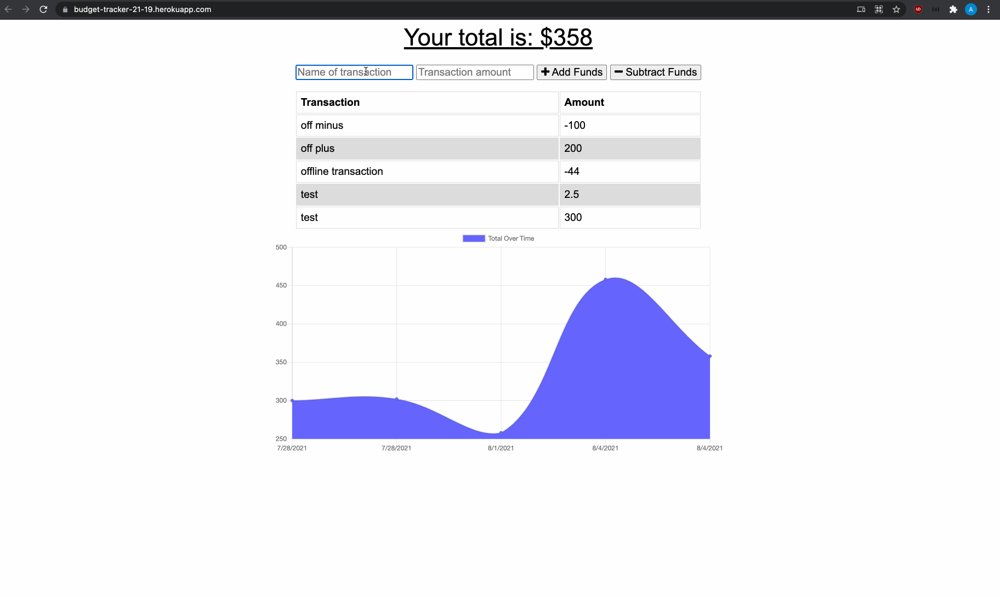

# Online/Offline Budget Tracker

[Budget Tracker](https://budget-tracker-21-19.herokuapp.com/)

## User Story

AS AN avid traveller
I WANT to be able to track my withdrawals and deposits with or without a data/internet connection
SO THAT my account balance is accurate when I am traveling

## Business Context

Giving users a fast and easy way to track their money is important, but allowing them to access that information anytime is even more important. Having offline functionality is paramount to our applications success.

## Acceptance Criteria

GIVEN a user is on Budget App without an internet connection
WHEN the user inputs a withdrawal or deposit
THEN that will be shown on the page, and added to their transaction history when their connection is back online.

## Requirements

- [x] Allow for offline access and functionality.

  - Offline Functionality:

    - [x] Enter deposits offline

    - [x] Enter expenses offline

  - When brought back online:

    - [x] Offline entries should be added to tracker.

- [x] Deploy your application with Heroku and MongoDB Atlas.
